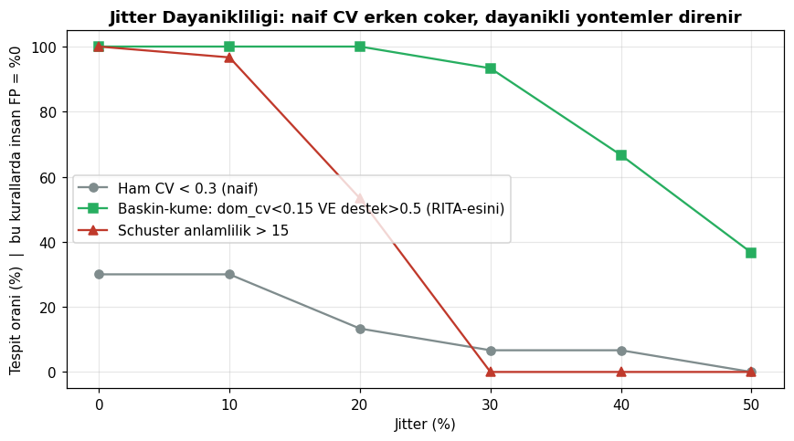
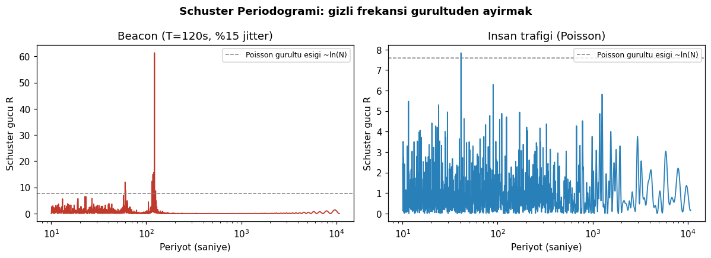
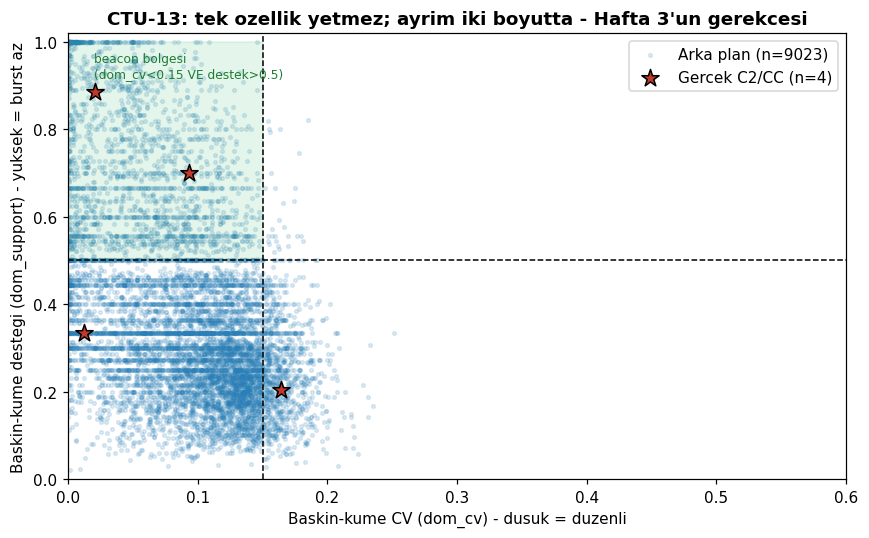
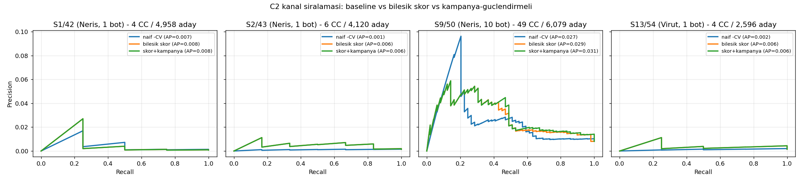

[](https://github.com/yigit006/heartbeat-hunter/actions)

🇬🇧 [English](README.md) | 🇹🇷 **Türkçe**

# Heartbeat Hunter

İstatistiksel temelli C2 beaconing tespit motoru. Zeek `conn.log` verisinden, jitter'lı
komuta-kontrol (C2) trafiğini saf matematikle yakalar: zaman serisi analizi,
olasılıksal skorlama ve graf analizi.

> **Durum:** v0.1 tamam — 4 CTU-13 senaryosunda (Neris ×3 + Virut) değerlendirildi.
> MITRE ATT&CK: [T1071](https://attack.mitre.org/techniques/T1071/) (Application
> Layer Protocol), [T1573](https://attack.mitre.org/techniques/T1573/) (Encrypted
> Channel) — tespit, içerik imzasına değil zamanlama/boyut davranışına dayanır.

## Neden?

Bir C2 implantı sunucusuna düzenli aralıklarla bağlanır. Saldırganlar bunu gizlemek
için jitter ekler — ama istatistik yalan söylemez. Heartbeat Hunter üç katmanla çalışır:

1. **Zaman serisi analizi** — dayanıklı dağılım istatistikleri (baskın-küme CV, MAD, Bowley skewness) + Schuster/Rayleigh periodogramı
2. **Olasılıksal skorlama** — çoklu sinyalin Bayes yaklaşımıyla birleştirilmesi
3. **Graf analizi** — anomaliden kampanya tespitine

## Yöntem (Katman 1)

Beacon'lar düzenli aralıklarla bağlanır; saldırgan bunu jitter ile gizler.
İki tamamlayıcı yöntem kullanıyoruz:

**Baskın-küme dağılımı** (RITA'dan esinlenildi): gerçek C2 trafiği beacon
aralıklarının arasına retry/çoklu-istek burst'leri karıştırır, bu yüzden ham
varyasyon katsayısı yanıltır. Bunun yerine inter-arrival dağılımının en yoğun
modunu bulup o küme içindeki dağılımı ölçeriz. Ama düşük küme-CV tek başına
yetmez (küme dar tanımlı olduğu için mekanik olarak küçük çıkar) — **küme desteği**
(aralıkların ne kadarının o kümede olduğu) ile birlikte kullanılır.



**Schuster periodogramı**: `R(f) = |Σ exp(2πi·f·tⱼ)|² / n`. Olay zamanlarında
doğrudan frekans taraması — binleme gerektirmez (FFT'nin düzensiz örneklemede
başarısız olduğu yerde çalışır), Poisson gürültüsü altında `R ~ Exp(1)` dağılır,
yani istatistiksel anlamlılık analitik olarak hesaplanır.



CTU-13 Senaryo 42 (Neris) üzerinde: tek özellik C2 kanallarını arka plandan
ayırmaya yetmiyor — bu, Katman 2'nin (çok-sinyal birleşimi) deneysel gerekçesi.



## Yöntem (Katman 2): bileşik skor + huni

RITA-esini, etiketsiz çalışan ağırlıklı bileşik skor: zaman alt-skorları
(baskın-küme, MAD, Schuster) + **bayt alt-skorları** (beacon payload'ı sabit
boyutludur — burst zamanlamayı bozar ama baytı bozmaz) + bağlam (hedef
nadirliği, süreklilik, port kategorisi). Anlamlılık, BAYWATCH-esini
kova-permütasyon testiyle ampirik olarak doğrulanır.

Skor tek başına yetmez: CTU-42 sınavında top-20'nin tamamı meşru periyodik
altyapıydı (NTP, SNMP, iç izleme). Literatürün cevabı ağırlık değil **filtre**
(BAYWATCH hunisi, Elastic yön filtresi): skor "beacon-gibiliği" ölçer, kapsam
filtresi (dış hedef + altyapı-portu-değil) C2 arama uzayını daraltır.
Sonuç: 12.220 çift → 4.958 aday; NTP/SNMP listeden temizlendi, dört C2
kanalının tamamı sırada 2-3 kat yükseldi.

```bash
hhunter score pairs.parquet --internal-net 147.32.0.0/16   # kapsam-içi liste
hhunter score pairs.parquet --all                          # ham sıralama
```

## Yöntem (Katman 3): graf — anomaliden kampanyaya

Tek beacon anomalidir; aynı hedefe **benzer periyotla** beacon atan ≥2 iç
makine kampanyadır. Skorlu kanallar iki parçalı grafa (kaynak↔hedef) konur;
paylaşılan hedefler periyot tutarlılığı ve kanal skorlarıyla birleşik
`campaign_score` alır.

**Çok-hostlu sınav (CTU-13 Senaryo 9, Neris, 10 bot):** tek-kanal skorlama
ilk C2'yi 67. sıraya koyabildi; kampanya katmanı **gerçek C2'yi
(195.190.13.70, 7 bot, 115 sn, tutarlılık 1.0) 1. sıraya** taşıdı. Senaryo
42'de 8.177. sıraya gömülen ana C2 (173.192.170.88), 8 bot'un kolektif
kanıtıyla kampanya #5. Top-10 kampanyanın 7'si botnet altyapısı — CC etiketi
taşımayan spam/click-fraud kanalları dahil (etiket-ötesi tespit). Dürüst
sınır: tek enfekte makineli yakalamada (S42) bu katman mekanik olarak
ateşleyemez (≥2 kaynak şartı) — orada 55 aday/0 CC.

```bash
hhunter campaign scored.parquet          # kampanya adayları
```

## Değerlendirme (CTU-13, kapsam-içi adaylar)



| Senaryo | İlk CC: naif −CV | İlk CC: bileşik | R@100: naif | R@100: bileşik |
|---|---|---|---|---|
| S1/42 (Neris, 1 bot) | 59 | **37** | 0.25 | 0.25 |
| S2/43 (Neris, 1 bot) | 869 | **89** | 0.00 | **0.17** |
| S9/50 (Neris, 10 bot) | 87 | **46** | 0.16 | 0.10 (R@500: 0.27→**0.41**) |
| S13/54 (Virut, 1 bot) | 1.091 | **89** | 0.00 | **0.25** |

Bileşik skor dört senaryonun dördünde de ilk-CC sırasını iyileştiriyor;
S2'de 10×, farklı ailede (Virut) 12×. Çok-bot'lu S9'da ek katman devreye
girer: **kampanya düzeyinde gerçek C2, 94 aday arasında #1** (tek-bot
yakalamalarda ≥2 kaynak şartı mekanik olarak sağlanamaz — dürüst sınır).

Katmanlı okuma: kanal düzeyinde, binlerce meşru periyodik yoklama (e-posta,
izleme, update) arasında C2'yi tek başına ayırmak istatistiksel dedektörlerin
ortak zorluğu (AP ≈ 0.03). Aracın asıl av listesi **kampanya düzeyi** —
gerçek C2, 94 aday arasında 1. sırada. İki tasarım dersi ölçümle belgelendi:
hedef-nadirlik sinyali çok-bot'lu yakalamada tersine döner (kanal skorundan
çıkarıldı, kampanya katmanına taşındı) ve Rbot senaryoları (S10/S11) CC
beaconing'i ölçülebilir yoğunlukta içermediğinden değerlendirme dışıdır.

## Kurulum

```bash
pip install -e ".[dev]"
```

## Kullanım (uçtan uca boru hattı)

```bash
# 1) Zeek conn.log veya CTU-13 .binetflow -> cift tablosu
hhunter ingest capture.binetflow -o pairs.parquet

# 2) Skorlama (kurumun kamu blogunu ic ag olarak tanit)
hhunter score pairs.parquet --internal-net 147.32.0.0/16 -o scored.parquet

# 3) Kampanya tespiti (>=2 ic kaynak ayni hedefe)
hhunter campaign scored.parquet

# SIEM/otomasyon icin her iki komutta JSON cikti:
hhunter score pairs.parquet --json | jq '.[0]'
hhunter campaign scored.parquet --json
```

## Analiz paneli (Streamlit)

CLI hunisinin insan-dostu yüzü — panel yalnızca okur, tüm analiz boru
hattında yapılır (ikinci bir hesaplama yolu yok):

```bash
pip install -e ".[demo]"
streamlit run app.py
```

Üç görünüm: filtreli aday tablosu, kanal detayı (zaman çizgisi + inter-arrival
dağılımı + periodogram + alt-skor kırılımı — "skor neden yüksek?" sorusunun
cevabı) ve kampanya listesi.

## Sınırlamalar (ölçülmüş ve belgeli)

- **%50+ jitter** tespit sınırıdır — aralıklar o noktada gerçek gürültüye
  dönüşür (dayanıklılık matrisi `docs/img/jitter_robustness.png`).
- **Kanal düzeyinde AP düşüktür** (~0.03): binlerce meşru periyodik yoklama
  (e-posta, izleme, update) beacon ile aynı zamansal imzayı taşır. Bu araç bir
  önceliklendirme hunisidir, tek başına hüküm makinesi değil.
- **Kampanya katmanı ≥2 enfekte kaynak ister** — tek-bot yakalamada mekanik
  olarak ateşleyemez.
- **Rbot/DDoS senaryoları (S10/S11) değerlendirilemedi**: CC beaconing'i
  ölçülebilir yoğunlukta değil — veri-uygunluk analizi olarak raporlandı.
- Gelecek iş: PU-learning ile az-pozitif kalibrasyon, Elastic-esini bucket
  otokorelasyonu (yüksek jitter); 50GB+/gün ölçeği için ingestion katmanının
  Polars/lazy-scan'e taşınması (şema kaynak-bağımsız olduğundan değişiklik
  `ingest.py` ile sınırlı kalır — bu ölçekte pandas bilinçli tercihti: 2.8M
  akış 14 sn).

## Yol Haritası

- [x] Hafta 1: Zeek conn.log ingestion + beacon simülatörü
- [x] Hafta 2: Zaman serisi katmanı (baskın-küme CV, MAD, Bowley, Schuster periodogramı)
- [x] Hafta 3: Bileşik skorlama (zaman+bayt+bağlam) + permütasyon anlamlılığı + huni filtresi
- [x] Hafta 3: Graf analizi / kampanya tespiti (networkx) — `hhunter campaign`
- [x] Hafta 4: Çok-hostlu senaryo (S9) + değerlendirme altyapısı + PR eğrileri
- [x] Hafta 4: 4 senaryoda değerlendirme (Neris ×3 + Virut) — aile-ötesi genelleme
- [x] Hafta 4: CLI `--json` (SIEM entegrasyonu) + sınırlamalar dokümantasyonu
- [x] Bonus: Streamlit analiz paneli (`streamlit run app.py`)

## Lisans

MIT
